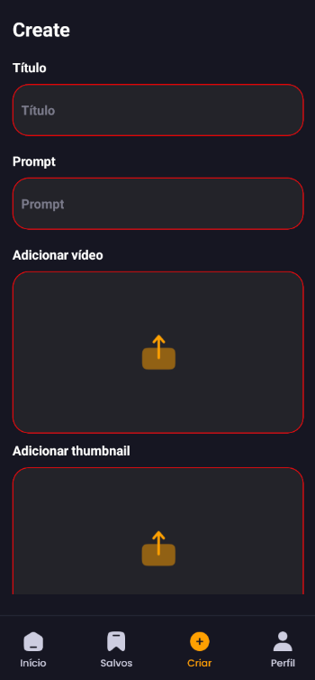
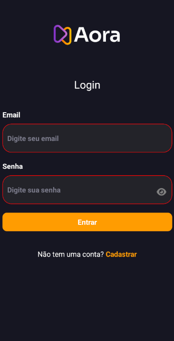
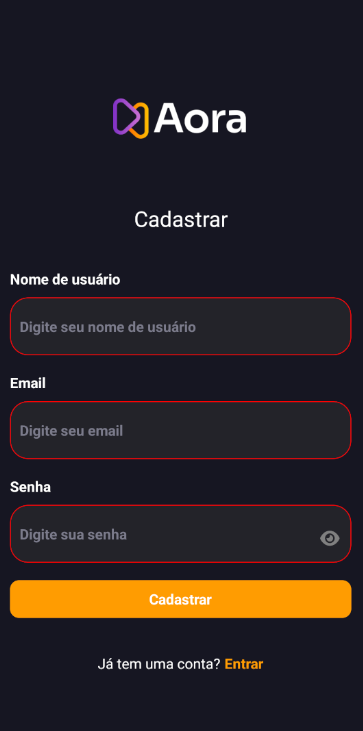

# Aora Mobile

<div align="center">
  <br />
  
  <br />

**Aora** is a mobile application built with **React Native** and **Expo**, designed as a study project to explore the capabilities of the Expo ecosystem. It features a modern UI for sharing and viewing AI-generated videos.

[](https://expo.dev/)
[](https://reactnative.dev/)
[](https://appwrite.io/)
[](https://www.nativewind.dev/)

</div>

## 📱 Screenshots

<div align="center">
  
  
  
</div>
<br />
<div align="center">
  
  
  
</div>

## 🛠 Tech Stack

- **React Native**: Core framework for building native apps using React.
- **Expo**: Platform and tools for developing universal React applications.
- **Expo Router**: File-based routing for React Native.
- **NativeWind (TailwindCSS)**: Styling system for rapid UI development.
- **Appwrite**: Backend-as-a-Service (BaaS) for authentication, database, and storage.
- **React Native Animatable**: For easy animations.

## 🚀 Getting Started

Follow these steps to set up the project locally on your machine.

### Prerequisites

- [Node.js](https://nodejs.org/) installed.
- [Expo Go](https://expo.dev/client) app on your mobile device (iOS or Android) or an emulator.

### Installation

1. **Clone the repository**

   ```bash
   git clone https://github.com/your-username/aora-mobile.git
   cd aora-mobile
   ```

2. **Install dependencies**

   ```bash
   npm install
   ```

3. **Configure Appwrite**

   If you want to use your own backend:
   - Create a project on [Appwrite](https://appwrite.io/).
   - Copy `appwrite.config.example.js` to `lib/appwrite.js` (or just update the existing `lib/appwrite.js` with your credentials).

   ```javascript
   export const appwriteConfig = {
     endpoint: "YOUR_ENDPOINT",
     projectId: "YOUR_PROJECT_ID",
     platform: "YOUR_PLATFORM",
     databaseId: "YOUR_DATABASE_ID",
     userCollectionId: "YOUR_USER_COLLECTION_ID",
     videoCollectionId: "YOUR_VIDEO_COLLECTION_ID",
     storageId: "YOUR_STORAGE_ID",
   };
   ```

4. **Run the app**

   ```bash
   npx expo start
   ```

   - Scan the QR code with **Expo Go** (Android) or use the Camera app (iOS).
   - Press `a` for Android Emulator or `i` for iOS Simulator.

## 🤝 Contributing

Contributions are welcome! Feel free to open an issue or submit a pull request.

## 📄 License

This project is open-source and available under the [MIT permissions](LICENSE).
